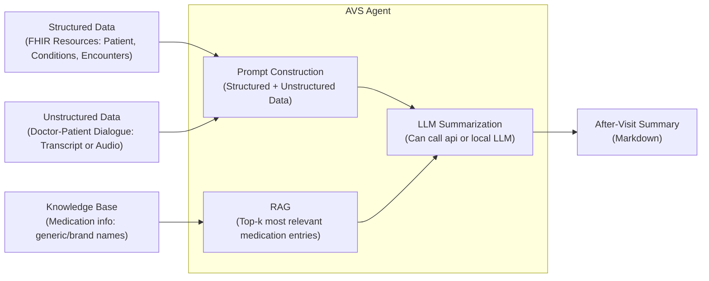

# After Visit Summary Agent

## Introduction  

Healthcare visits often generate a large amount of unstructured information — clinical conversations, physician notes, medication adjustments, and follow-up instructions. Patients are typically given an *After Visit Summary (AVS)*, but creating one manually is time-consuming for clinicians and often incomplete for patients.  

This project explores how **structured EHR data (FHIR resources)**, **unstructured visit transcripts**, and a **medication knowledge base (KB)** can be integrated with a **Large Language Model (LLM) + Retrieval-Augmented Generation (RAG)** pipeline to automatically generate a high-quality, patient-friendly AVS.  

Key aspects:  
- **FHIR Resources:** Patient demographics, conditions, medications, and lab requests are represented in standard [FHIR](https://www.hl7.org/fhir/) format.  
- **Visit Transcripts:** Example transcripts are provided. If only an audio file is available, it can be transcribed using tools like [OpenAI Whisper](https://github.com/openai/whisper) or [AssemblyAI](https://www.assemblyai.com/).  
- **Medication Knowledge Base (KB):** A structured CSV with drug generic/brand names, class, indication, side effects, and monitoring parameters. This supports retrieval of relevant drug information even if only a brand or generic name is mentioned in the transcript.  
- **LLM with RAG:** The model takes transcript + FHIR + KB context, and produces a structured summary that covers diagnoses/issues, treatment plan, and relevant lifestyle recommendations.  

The goal is to demonstrate how multi-modal clinical data can be automatically synthesized into an AVS that reduces clinician burden while improving patient understanding.  




---

## Requirements & Setup  

### Prerequisites
- Python 3.10+  
- [uv](https://docs.astral.sh/uv/) for environment management  
- Valid API keys for LLM (e.g. Gemini or OpenAi)

### Environment Setup
```bash
git clone https://github.com/sppandlkk/after-visit-summary-agent.git
cd after-visit-summary-agent

# use uv to manage package
un sync

# to start the service
uv run uvicorn app.main:app --env-file=.env --reload 
```

Make sure `.env` file has necessary information:
```
LLM_PROVIDER=gemini # or openai
AI_MODEL=gemini-1.5-flash # or gpt-4o-mini
GEMINI_API_KEY=xxxxxx
# OPENAI_API_KEY=sk-xxxx

# FHIR Server (If using a real FHIR server)
FHIR_API_BASE=https://demo.fhir.com
FHIR_API_KEY=xxxxxx
```

To run pytest locally:
```
PYTHONPATH=. uv run pytest
```
---

## Running the Pipeline

This project is set up to run on real data by connecting to a FHIR server and gaining access to medication knowledge and visit transcript. We will first go over how to deploy in production, and then also demostrate how to run this locally using mock data.

### 1. Production Implementation (with FHIR + real transcripts)

If you want to integrate this pipeline into a production environment:  

- Make sure you have access to a running **FHIR endpoint** (e.g., an EHR system).  
- Provide a **real transcript** (from an audio recording you transcribed, e.g., via [OpenAI Whisper](https://github.com/openai/whisper) or [AssemblyAI](https://www.assemblyai.com/)).  
- Place your **medication knowledge base** under `data/med_kb/medications.csv` (example structure provided in this repo).  
- Run the FastAPI service and call the API endpoint with the required inputs:  

Example:

```bash
curl -X POST http://127.0.0.1:8000/generate_avs \
  -H "Content-Type: application/json" \
  -d '{
    "patient_fhir_id": "real-patient-123",
    "transcript_path": "data/transcripts/real_visit.txt",
    "k": 3
  }'
  ```
Here:

- patient_fhir_id will be used to fetch demographics and conditions from your FHIR server.
- transcript_path points to the transcript file
- k controls how many knowledge base snippets are retrieved by the RAG engine.

The generated After-Visit Summary (AVS) will be written into output/AVS_{patient_fhir_id}.md.


### 2. Demo (mock data)

For demonstration, this repo includes mock FHIR data, example transcripts, and a small medication knowledge base:
- FHIR patient resources are under data/fhir/ (mock JSON files).
- Example transcripts are under data/transcripts/.
- A small `medications.csv` file is provided under data/med_kb/ for RAG lookups.

You can try generating summaries with the mock setup directly:
```bash
curl -X POST http://127.0.0.1:8000/generate_avs \
  -H "Content-Type: application/json" \
  -d '{
    "patient_fhir_id": "demo-patient-1",
    "transcript_path": "data/transcripts/visit1_raw.txt",
    "k": 2
  }'
  ```
Sample output: [output/demo-patient-1.md](output/demo-patient-1.md)  

#### How it works
- Patient demographics and existing conditions come from FHIR.
- Diagnoses and treatment plan are summarized from the transcript by the LLM.
- Medication details are enriched with RAG lookups from the internal knowledge base (brand/generic names, side effects, monitoring, etc.).

This combination allows the pipeline to automatically generate a patient-friendly After-Visit Summary that integrates structured EHR data with conversational context.

---

## Notes  

- This repository is for **research and prototyping** only.  
- It uses **mock data**, not real patient information.  
- Not intended for clinical decision-making without validation.  
